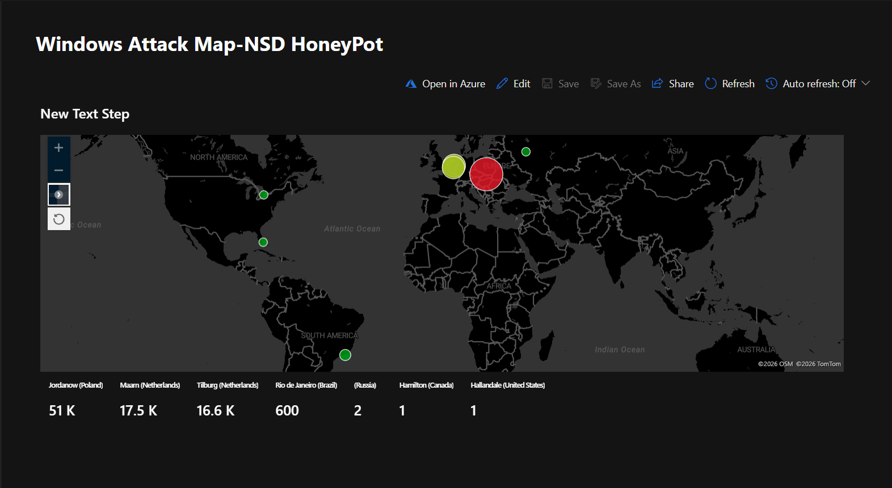
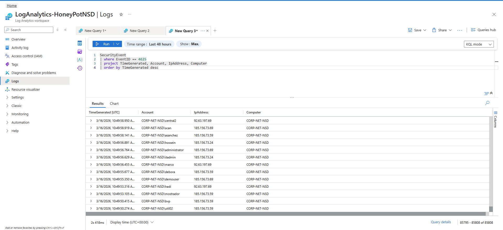
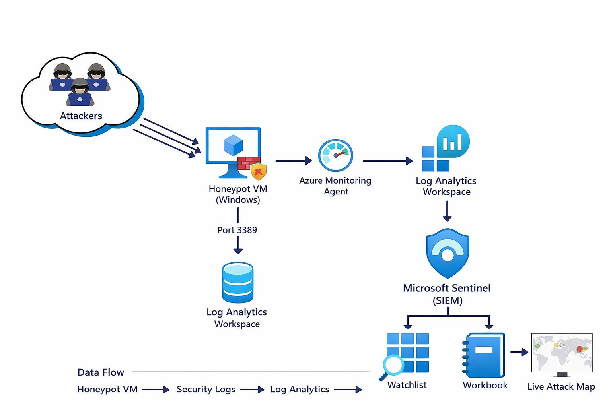

# 🛡️ Azure Sentinel SIEM Home Lab – Attack Detection & Visualization

## 📌 Overview

This project demonstrates a **cloud-based SIEM (Security Information and Event Management) lab** built using Microsoft Azure and Microsoft Sentinel.

A deliberately exposed virtual machine (honeypot) was deployed to simulate a vulnerable system. Security logs were collected, analyzed, and visualized to observe real-world attack behavior.

---

## 🎯 Objectives

* Simulate real-world brute-force attack traffic
* Monitor and analyze failed login attempts
* Visualize attacker activity globally
* Gain hands-on experience with SIEM workflows

---

## 🧱 Architecture

**Data Flow:**

Attacker → Azure VM (Honeypot) → Log Analytics Workspace → Microsoft Sentinel → Visualization (Attack Map)

---

## ⚙️ Technologies Used

* Microsoft Azure
* Microsoft Sentinel (SIEM)
* Log Analytics Workspace
* KQL (Kusto Query Language)
* Windows Security Event Logs

---

## 🚀 Implementation Summary

### 🔹 Honeypot Deployment

A Windows virtual machine was deployed in Azure and configured to allow inbound RDP (port 3389) traffic.
This was done intentionally to simulate a vulnerable system and attract unauthorized login attempts.

---

### 🔹 Log Collection

Security event logs were enabled and forwarded to a Log Analytics Workspace.
This enabled centralized log ingestion and querying within Microsoft Sentinel.

---

### 🔹 Threat Detection (KQL)

KQL queries were used to identify failed login attempts (Event ID 4625), allowing detection of brute-force activity.

---

### 🔹 Data Enrichment

Attacker IP addresses were enriched using geolocation data to identify the origin of login attempts.

> Note: API keys are excluded for security reasons.

---

### 🔹 Visualization

A custom workbook was created in Microsoft Sentinel to display a global attack map, providing real-time visibility into attack sources.

---

## 📊 Results

* Continuous brute-force login attempts observed
* Multiple attacker IPs from different geographic locations
* Real-time visibility into attack patterns

---

## 🧠 Key Learnings

* SIEM data ingestion and analysis
* Writing KQL queries for threat detection
* Understanding brute-force attack patterns
* Importance of monitoring exposed systems
* Foundational SOC (Security Operations Center) workflows

---

## 📸 Screenshots

### 🌍 Attack Map

### 📊 KQL Query

### 📑 Failed Login Logs

### 🧱 Architecture

---

## 🔐 Security Considerations

This project was conducted in a **controlled lab environment**.

* No production systems were used
* No sensitive credentials or API keys are exposed
* All data shown is safe for demonstration purposes

---

## 🚀 Future Improvements

* Implement alert rules in Microsoft Sentinel
* Automate responses using Azure Logic Apps (SOAR)
* Integrate threat intelligence feeds
* Expand detection use cases

---

## 👨‍💻 Author

**Nathan Diambamba**
Aspiring Cybersecurity / Cloud Engineer
